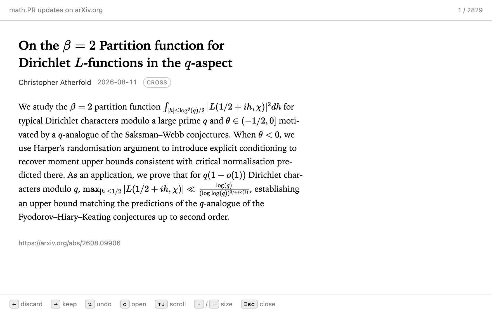
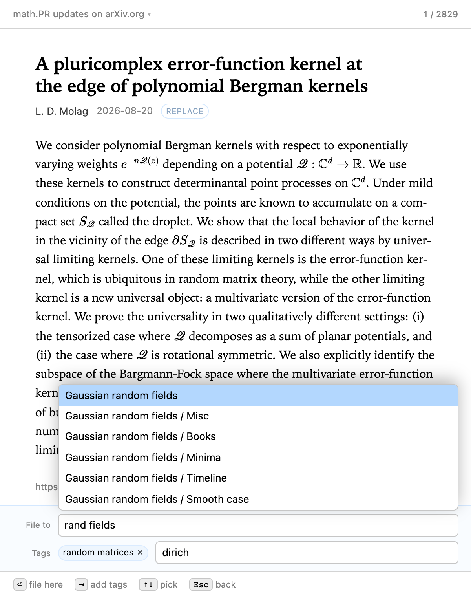
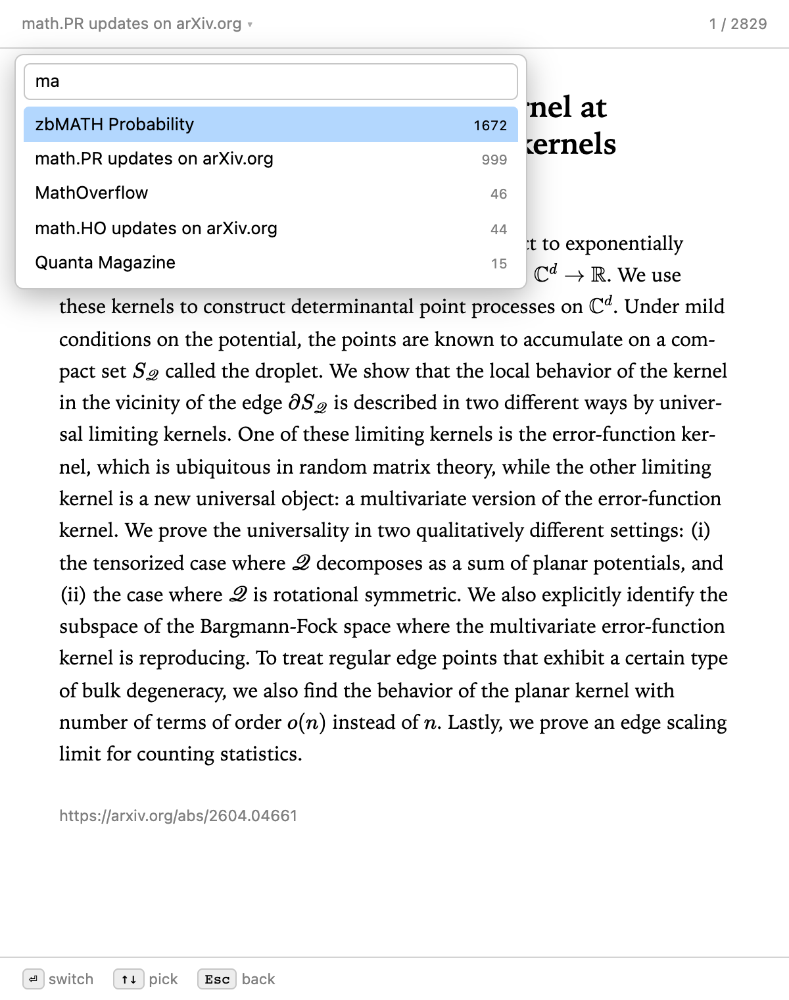

# Feed Riffle

A Zotero 7+ plugin for clearing an RSS feed backlog at speed.

Zotero's feed reader is a three-pane library view: click an item, read it,
click *Add to My Library*, wait for a translator, pick a collection in a
dialog. Fine for five items a week. At two thousand unread it is why the
backlog exists.

Feed Riffle deals the unread items out one card at a time and puts the whole
decision on the arrow keys.

Right arrow opens the filing panel: fuzzy-search your collections, add tags, add
a note.

## Use

**Tools → Riffle Feeds…** for every feed at once, or right-click a feed in the
collections pane → **Riffle This Feed…** to work through one.

Each card shows the title, authors, date and abstract.

| Key | |
|---|---|
| <kbd>←</kbd> | discard — marks it read and moves on |
| <kbd>→</kbd> | keep — opens the filing panel |
| <kbd>s</kbd> | skip — leave it unread for another day |
| <kbd>1</kbd>–<kbd>9</kbd> | file straight into a recently used collection |
| <kbd>u</kbd> / <kbd>Ctrl</kbd>+<kbd>Z</kbd> | undo the last discard, save or skip |
| <kbd>f</kbd> | switch feed (or click the feed name) |
| <kbd>o</kbd> | open the paper in your browser |
| <kbd>↑</kbd> <kbd>↓</kbd> / <kbd>Space</kbd> | scroll a long description |
| <kbd>+</kbd> / <kbd>−</kbd> / <kbd>0</kbd> | text bigger, smaller, reset (<kbd>⌘</kbd>/<kbd>Ctrl</kbd> too) |
| <kbd>Esc</kbd> | close |

Three outcomes, not two. <kbd>←</kbd> discards, <kbd>→</kbd> files, and
<kbd>s</kbd> skips — leaving the item unread so it comes back another day.
Having to reach a verdict on every single card is what turns a backlog into a
wall.

Most items go to a handful of collections, so the handful get a number each:
<kbd>1</kbd>–<kbd>9</kbd> files straight from the card without opening the
panel. The numbers are the rows at the top of the collection picker, so you can
see which is which.

A card whose DOI or arXiv id is already in your library is marked **in library**.
The version suffix is ignored, so a `replace` announcement finds the copy you
saved months ago. Filing still makes a second item — the new version is a new
record — so the panel asks what to do with the old one and tells you what it is
worth: *"Already in your library — filing adds a second item. The old one holds
2 notes and 14 annotations. Ctrl+D trashes it."* <kbd>Ctrl</kbd>+<kbd>D</kbd>
toggles; the default is to keep both. Trashing means Zotero's trash, so nothing
is destroyed and <kbd>u</kbd> puts it straight back.

The collections the old copy is in are hoisted to the top of the picker, marked
*already in* — usually where the new version belongs too.

When a feed runs out, the finish screen lists the feeds that still have unread
items, with their counts — <kbd>Enter</kbd> carries straight on into the top one.
Reaching the end is when you are most likely to want another, so it is offered
rather than left for you to go and find.

### Switching feeds

The feed name in the top left is also the scope control: click it, or press
<kbd>f</kbd>, for a fuzzy search over your feeds with the unread count beside
each. Pick one to riffle just that feed, or *All feeds* for everything at once.

### Filing

<kbd>→</kbd> opens a panel already pointed at the collection you used last, so
<kbd>Enter</kbd> alone files it there. Otherwise type: the box fuzzy-matches
the full collection path, so `prs` finds *Probability / SPDEs* and
`paths rough` finds *Probability / Rough paths*.

<kbd>Tab</kbd> instead of <kbd>Enter</kbd> accepts the highlighted collection —
the box then reads it back to you — and opens a tag box, which fuzzy-completes
your existing tags. <kbd>Enter</kbd> commits a tag, taking the highlighted
suggestion when there is one; <kbd>Shift</kbd>+<kbd>Enter</kbd> commits the words
exactly as typed, which is how you make a tag that merely looks like one you
already have. <kbd>Enter</kbd> on an empty box files the item. <kbd>Tab</kbd>
again opens the note box, where <kbd>Enter</kbd> files and
<kbd>Shift</kbd>+<kbd>Enter</kbd> makes a newline. <kbd>Shift</kbd>+<kbd>Tab</kbd>
moves back a row and <kbd>Esc</kbd> steps back one at a time; either way the row
you return to opens its own fuzzy list again.

## How it stores things

Nothing of its own, beyond remembering the last collection and the window
position.

*Discarded* is Zotero's own per-item read flag — the same one the unread
counts in the collections pane use, and the one Zotero's existing feed cleanup
reaps items on. So discarding here is exactly discarding there, and nothing
this plugin does needs undoing if you uninstall it.

*Keeping* clones the feed entry straight into the collection, locally. It does
**not** run `translate()` the way *Add to My Library* does: that loads the page
in a hidden browser and runs a translator, which takes seconds per item and is
precisely the friction this plugin exists to remove. You get the feed's own
metadata — title, authors, date, abstract, DOI, URL — and no web snapshot. The
PDF *does* follow: the item goes through the same resolvers as Zotero's *Find
Available PDF* (the DOI, then the landing page — an arXiv abstract page
advertises its PDF, so no DOI is needed), in the background, after the card has
already flicked away. For the handful of papers that deserve full metadata,
Zotero's own *Add to My Library* is still right there.

## Reading what the feeds actually send

Feed metadata arrives raw and no two sources format it the same way, so the card
normalises it before showing you anything.

**Descriptions are rendered, not flattened.** A feed that really sends HTML keeps
its structure — paragraphs, quotes, lists, headings, links. That HTML is
untrusted input, so it goes through Gecko's own sanitizer (`nsIParserUtils`, the
same service Zotero uses for untrusted note and annotation HTML) rather than
anything hand-written here. Remote media is dropped: an `` in an RSS item is
as often a tracking pixel as a picture, and a reader should not phone home for
every card you flick past. Feed stylesheets are dropped too, so the card keeps
its own typography. Links open in your browser, not in the riffle window.

**Formulas are typeset by KaTeX**, which is bundled with the plugin — the real
thing, not an approximation: environments, `\left…\right` that stretches to
what it contains, `\begin{cases}`, author-defined macros, everything a feed's
LaTeX can hold. All four delimiter styles are understood — `$…$`, `$$…$$`,
`\(…\)` and `\[…\]` — in titles as well as descriptions. KaTeX loads on first
use rather than at startup, so a plugin you never open costs nothing.

`\color` means two different things and feeds contain both. MathJax reads
`\color{red}{x}` as two arguments and tints only `x`; LaTeX reads `\color{red}`
as a switch that tints the rest of the group. They are told apart by what
follows the colour — a brace is the argument form — so that one is rewritten to
`\textcolor`, which is unambiguous, and the switch form is left for KaTeX to
handle as LaTeX specifies. Both work.

A `$` only opens math when what follows reads like math. Outside academic feeds
a dollar sign is usually money, and "raised $5 million and $10 million" must not
become an equation.

**Text size** starts from Zotero's own font-size setting, so the window matches
the rest of the app, and <kbd>+</kbd>/<kbd>−</kbd> adjusts from there and
remembers. Every size in the stylesheet is in `rem`, so one number scales the
prose, the math and the chrome together rather than drifting apart.

**Prose is set as prose:** `--` becomes an en dash, `` ``quoted'' `` becomes
curly quotes, and text is held to a readable measure — about 34rem, near the 75
characters past which the eye starts losing the next line. The window opens at a
fixed 600×760, chosen to fit that column with no dead margin, and stays that
shape whatever the item or the font size. Resize it and the size is remembered;
widen it past the column and the text centres rather than hugging the left edge,
the way a reader should. Descriptions are set in a serif, which is what
long-form reading wants and what sits with KaTeX's Computer Modern — a sans body
beside serif formulas reads as two documents stapled together. The chrome stays
in the system UI font, because it is UI. Hyphenation is on, using the item's own
language field, since at this measure it takes the worst of the rag out.

**Author names are de-LaTeXed** (`Bu\v{s}i\'{c}` → `Bušić`), and common feed
boilerplate is dropped — arXiv's `Announce Type:` header becomes a small badge,
so a revision reads differently from a new paper at a glance.

**Tags the feed itself supplied** are shown under the byline, and carried over
when you file the item. Nothing is inferred from the title or anywhere else.
Worth knowing: Zotero's feed reader does not currently turn RSS `<category>`
elements into tags — `feedReader.js` marks that "not yet implemented" — so for
most feeds this shows nothing today.

**The item URL is a link**, as is anything linked inside a description. Both
open in your browser rather than navigating the riffle window away.

### When the importer has already broken it

Zotero HTML-parses every feed abstract before storing it, so what a plugin reads
back is always serialised HTML — including for feeds that sent plain text. That
has one destructive consequence: a `<` in math (`$i<j$`) is read as a tag, and
the words after it are stored as its attributes.

So the description is handed to the platform's parser and the resulting tree
decides what the source was. Contains block elements: the feed really sent HTML.
Contains none: it was prose all along, and every element found in it is damage —
so each is serialised back into the characters it was made from, the exact
inverse of what the importer did. Not all of it returns, because HTML lowercases
attribute names and silently drops duplicates, so a word repeated inside the
damaged span is gone for good.

This needs a literal `<` in a plain-text feed, so it is rare — but arXiv math
hits it, and undoing it beats displaying it.

KaTeX is vendored rather than reached for at runtime: Zotero ships the same
version (0.16.22), but sealed inside the note editor's webpack bundle with no
export to reach. That costs about 350KB in the `.xpi`, nearly all of it the
maths fonts, and buys correct rendering of essentially everything: across a
2,800-item library it typeset 11,750 formulas and flagged four, each of them
genuinely malformed at the source. What it cannot parse it marks in place, and
the card shows the LaTeX rather than swallowing the sentence. A run too long to
be a formula is a mis-detected delimiter that has swallowed prose, and is set as
text instead.

## Install

Download `feed-riffle.xpi` from
[Releases](https://github.com/ievlevpn/zotero-feed-riffle/releases) → Zotero →
Tools → Plugins → ⚙ → Install Plugin From File…

## Third-party

Formulas are rendered by [KaTeX](https://katex.org) 0.16.22 (MIT), vendored in
`katex.min.js`, `katex.min.css` and `fonts/`. Its licence is in `LICENSE-KaTeX`.

## Develop

Plain bootstrapped plugin, no build step. `node test.js` checks the pure helpers
— fuzzy ranking, the LaTeX parser and its MathML output, delimiter splitting,
the importer-damage inverse, tag splitting and typography. `./release.sh` cuts a
release after you bump `version` in `manifest.json`.
